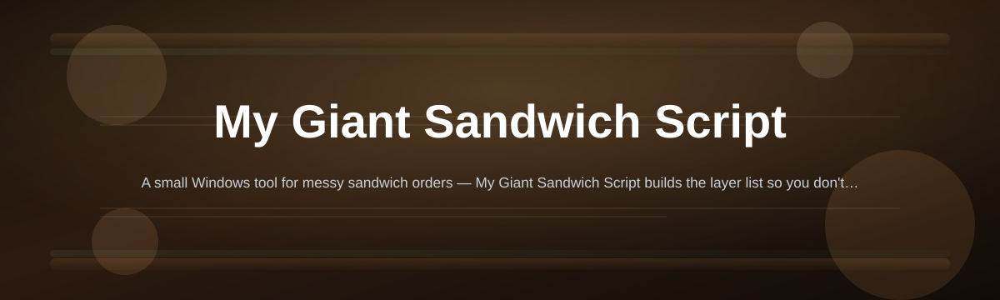
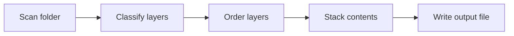

# sandwich-builder-script

*A one-file Windows script that turns loose ingredient files into one giant, correctly-ordered sandwich — no editor required.*

## What this is

**My Giant Sandwich Script reads a folder of ingredient files and assembles them into a single, properly layered sandwich file, in order, every time.**

The full story

This started as a way to stop manually reordering dozens of small text-based "ingredient" files before combining them into a final build — bread, filling, condiments, bread, in that exact order, every single time, by hand. My Giant Sandwich Script automates that entire stacking process: point it at a folder, and it figures out the correct layer order, checks for anything missing, and writes out one finished file. What began as a personal shortcut turned into a script other people asked to borrow, so it became this repository.

My Giant Sandwich Script is a standalone Windows tool built for one job: taking many small pieces and turning them into one large, ordered result without you touching the layer sequence yourself. It doesn't edit your ingredients — it reads them, sorts them by role, and stacks them the way a real sandwich goes together, bottom bread to top bread.

It runs on its own. There's no install wizard, no background service, and no account. You run the script, point it at a folder, and it hands you back one file: your giant sandwich, fully assembled.

  

The button above opens the project's landing page, where the current build of My Giant Sandwich Script is available to download.

## Who it's for

- **Anyone with a folder of ordered pieces** that need to become one final, stacked file.
- **Windows users who don't want a build toolchain** just to combine a batch of files correctly.
- **People who've done this stacking by hand before** and are tired of re-ordering layers themselves.
- **Hobby scripters and tinkerers** who like small, single-purpose tools that do one job well.
- **Anyone who found this through the sandwich-builder-script landing page** and wants to know what it actually does before downloading.

## What you can do

- **Auto-detect layer order** from filenames or a simple manifest, so bread stays on the outside.
- **Stack unlimited ingredient files** into one combined output, regardless of folder size.
- **Flag missing layers** before building, so you're not left with a sandwich that's missing its bread.
- **Preview the stack order** in the console before committing to the final build.
- **Rebuild instantly** by re-running the script — no cached state to clear.
- **Name and export the final file** wherever you choose on disk.
- **Run fully offline**, with nothing sent anywhere while it works.
- **Skip broken or empty ingredient files** automatically instead of failing the whole build.

## Up and Running

1. Open the landing page using the download button above.
2. Download the latest My Giant Sandwich Script build for Windows.
3. Unzip it anywhere — no installer, no setup steps.
4. Run the script and point it at your ingredients folder.
5. Open the finished sandwich file it writes out.

## Requirements

- Windows 10 or Windows 11.
- No Python, Node, or any other toolchain installed.
- No admin rights needed — it runs as a standalone script.
- A folder of ingredient files to feed it (the script tells you if something's missing).

## How it works

1. **Scan** — reads every file in the target folder.
2. **Classify** — sorts each file into a layer role (bread, filling, condiment).
3. **Order** — arranges layers into a valid sandwich sequence.
4. **Stack** — merges everything into one combined structure.
5. **Write** — saves the final giant sandwich as a single output file.

## Frequently asked questions

**What does My Giant Sandwich Script actually build?**
It builds one combined output file from many smaller "ingredient" files, in a fixed, predictable layer order — similar to how a real sandwich is assembled from bottom to top.

**Do I need to name my files in a specific way?**
The script looks for common layer keywords in filenames first. If it can't tell what a file is, it asks you or skips it — it won't guess silently.

**Can I use it on a very large number of ingredient files?**
Yes. It's built to handle large batches; the "giant" in the name refers to the resulting file size and ingredient count, not a limit on how many you can use.

**Does it modify my original ingredient files?**
No. It only reads them. The original files stay untouched; only the final combined output is newly written.

**Why is this Windows-only?**
It's built and tested specifically as a standalone Windows script, so behavior stays consistent without needing a cross-platform runtime.

## Troubleshooting

- **The script says a layer is missing.** Check that your folder includes at least one file for each required role (usually bread on both ends) before rebuilding.
- **The output file looks empty or too small.** Confirm the ingredient files aren't empty themselves — the script skips zero-byte files by design.
- **Windows blocks the script from running.** Right-click the file, open Properties, and unblock it, since it isn't digitally signed.
- **The layer order looks wrong.** Rename ambiguous files to include a clear role keyword, or check the console preview before the final build step.

## License

Released under the [MIT License](LICENSE). My Giant Sandwich Script is provided as-is, with no warranty — check the output before relying on it for anything important.

  

